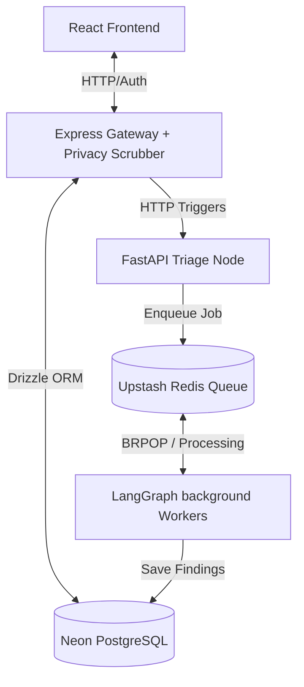

# VeriLaw AI — Enterprise Legal Auditing & Privacy Platform

VeriLaw AI is a secure, state-of-the-art legal auditing system designed to automatically scan corporate agreements, redact Personally Identifiable Information (PII) before it leaves the secure gateway, and audit the contract for material legal risks (such as uncapped liabilities and auto-renewal clauses).

---

## 🏛️ System Architecture

The application is built on a split-trust, privacy-first parallel architecture:



### 1. Secure Privacy Gateway (Node.js Express)
* **Text Extraction:** Uses `pdf-parse` to extract clean text from uploaded files (PDFs, TXT, OCR-ready images).
* **Privacy Scrubber:** Runs a fast, local Regex engine to anonymize emails, phone numbers, tax IDs, and corporate entity/personal names. Replaces PII with secure keys (e.g. `[REDACTED_NAME_1]`) before sending data to any external LLMs.
* **Database:** Powered by Drizzle ORM connecting to a Neon PostgreSQL database. Stores users, document metadata, PII mappings, and audit results.

### 2. Risk Language Model (FastAPI + LangGraph)
* **Intelligent Router:** Classifies contract types (MSA, NDA, SOW) and runs triage to determine complexity (using `llama-3.1-8b-instant`).
* **Map-Reduce Auditing:** Splices the document text into pages and fans them out to background workers in parallel.
* **Worker LLMs:** Standard or low-risk documents run on `llama-3.1-8b-instant`, while complex or high-risk contracts utilize `llama-3.3-70b-versatile` via Groq.
* **Synthesis & Save:** Merges worker findings, filters out hallucinations, and writes the final markdown executive summary and categorized risk list directly back to the Neon PostgreSQL database.

---

## 🛠️ Technology Stack

| Component | Technologies |
|---|---|
| **Frontend** | React, TypeScript, Vite, Vanilla CSS, Lucide Icons |
| **Gateway Service** | Node.js, Express, Multer, Drizzle ORM |
| **Microservice** | Python, FastAPI, LangGraph, Pydantic |
| **Message Queue** | Redis (supports Upstash Redis / local Redis) |
| **Database** | PostgreSQL (Neon serverless Postgres) |
| **LLM Provider** | Groq Cloud APIs (`llama-3.1-8b-instant` / `llama-3.3-70b-versatile`) |

---

## 🚀 Getting Started

### Prerequisites
* **Node.js** (v18+)
* **Python** (3.10+)
* **Redis** (local instance or an Upstash connection string)
* **Groq API Key** (from the [Groq Console](https://console.groq.com/keys))

---

### Step 1: Set up the Express Gateway
1. Navigate to the server folder:
   ```bash
   cd Server
   ```
2. Install dependencies:
   ```bash
   npm install
   ```
3. Configure environment variables in a `.env` file:
   ```env
   PORT=3001
   DATABASE_URL=postgresql://<user>:<password>@<host>/neondb?sslmode=require
   FASTAPI_URL=http://localhost:8000
   INTERNAL_SERVICE_TOKEN=your-random-secure-token
   JWT_SECRET=your-jwt-signing-secret
   ```
4. Start the server:
   ```bash
   npm run dev
   ```

---

### Step 2: Set up the FastAPI RLM Microservice
1. Navigate to the microservice folder:
   ```bash
   cd RLMmicroservice
   ```
2. Install dependencies:
   ```bash
   pip install -r requirements.txt
   ```
3. Configure environment variables in a `.env` file:
   ```env
   DATABASE_URL=postgresql://<user>:<password>@<host>/neondb?sslmode=require
   REDIS_URL=redis://localhost:6379
   GROQ_API_KEY=your-fallback-groq-key
   INTERNAL_SERVICE_TOKEN=your-random-secure-token
   ```
4. Start the API Gateway:
   ```bash
   uvicorn main:app --host 0.0.0.0 --port 8000
   ```
5. Start the background worker:
   ```bash
   python worker.py
   ```

---

### Step 3: Set up the React UI
1. Navigate to the client folder:
   ```bash
   cd ReactClient
   ```
2. Install dependencies:
   ```bash
   npm install
   ```
3. Configure environment variables in `.env` (optional, defaults to port 3001):
   ```env
   VITE_API_URL=http://localhost:3001
   ```
4. Start the development server:
   ```bash
   npm run dev
   ```

---

## 🛡️ Privacy & Throughput Design
* **Data Privacy:** PII is scrubbed before transmission. The LLM only processes the redacted version of the text, guaranteeing zero-leakage enterprise privacy.
* **Throughput Control:** Page-level parallel audits are throttled via an `asyncio.Semaphore(3)` to maximize throughput without exceeding Groq API rate-limiting thresholds (RPM/TPM).
